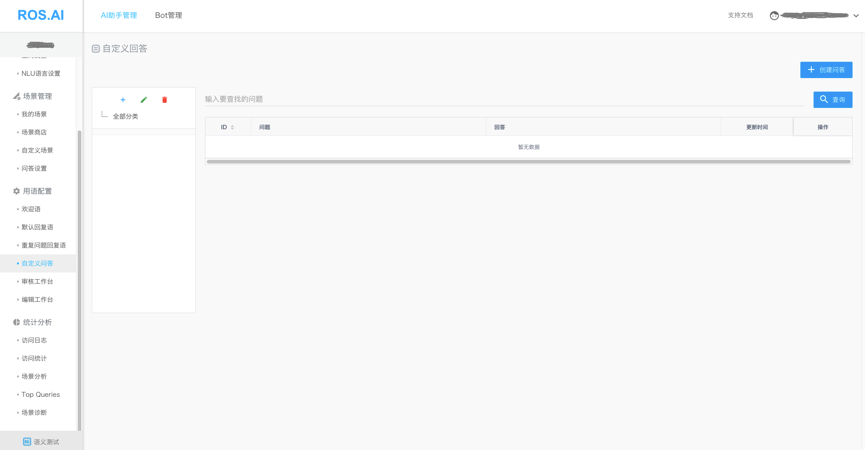
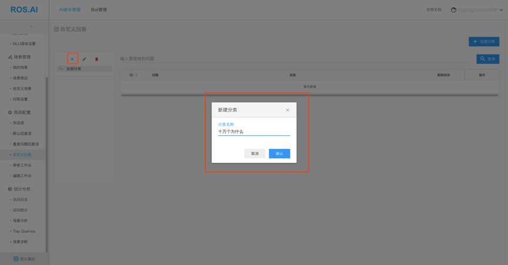
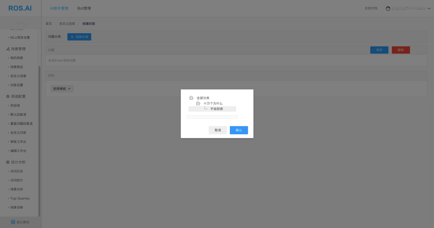
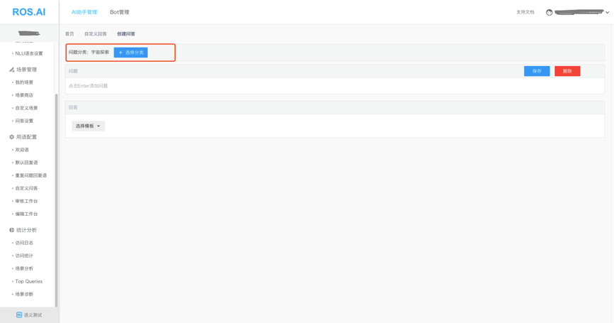
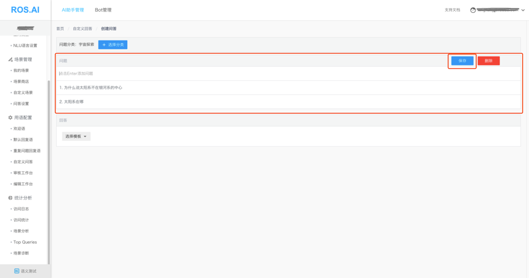
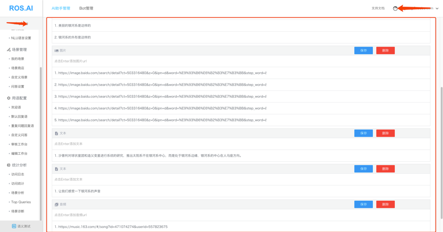
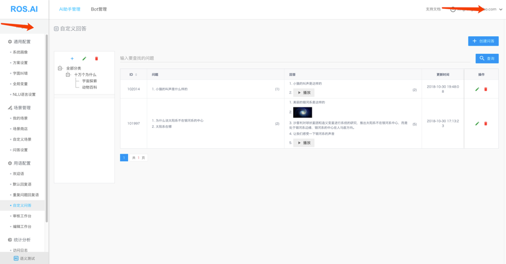

# 自定义问答
在这里，您可以给自己的应用创建一些更开放性的问答对，让应用更智能化。
## 一. 创建
登录ROS.AI平台->选择应用->Bot服务->AI助手管理-> 自定义问答

### 1. 创建分类

### 2. 创建问答

#### 2.1 选择分类

#### 2.2 添加问题
添加完问题后，点击“保存”，问题整体进行存储

#### 2.3 添加回答
回答由多个模板（最多10个）组成。模板分为文本，音频，图片。每个模板最多支持创建5条。每个模板也是整体保存。

### 3. 问答列表

## 二. 使用场景
### 1. 有屏设备
问题：为什么说太阳系不在银河系的中心？  
回复：(1)美丽的银河系是这样的   
(2)

(3)沙普利对球状星团和造父变星进行系统的研究，推出太阳系不在银河系中心，而是处于银河系边缘，银河系的中心在人马座方向   
(4)让我们感受一下银河系的声音    
(5)播放上传的“银河系”的音频
### 2. 无屏设备
问题：小猫的叫声是什么样的？  
回复：(1)小猫的叫声是这样的   
     (2)播放上传的“小猫叫声”的音频

