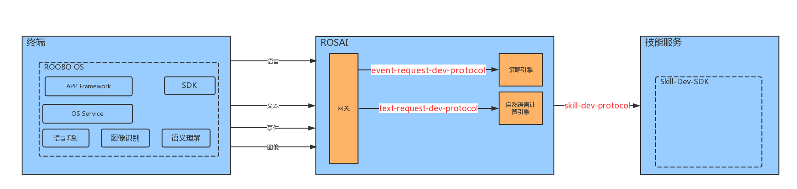

下面是ROSAI对话系统逻辑视图
 

> 图中箭头所示协议参见本目录中相应的同名文件
>

### 一些概念

在了解本文所描述协议之前，需要对ROSAI对话系统中的一些概念作如下说明：

* **终端** - 用于向ROSAI发起请求和处理返回结果的设备端。客户一般可以基于Roobo OS快速构建一个客制化的版本。*终端* 主要请求类型包括语音、文本、图像、事件。
* **ROSAI** - [_Roobo AI开放平台_](https://bot.ros.ai)。ROSAI中 *网关* 用于传递请求和分发请求。策略引擎加载规则并由事件请求驱动做行为输出。自然语言计算引擎由文本请求驱动做分析计算。这两个计算引擎一起构成云端大脑，分析请求并生成相应的回复。
* **技能服务** - 不是所有的技能都需要开发技能服务，[_Roobo AI开放平台_](https://bot.ros.ai)提供意图答复配置可以满足一些简单的用户场景，除此之外若用户需要实现复杂对话流程管理，则需要开发一个服务。客户一般可以基于Roobo Skill-Dev-SDK（目前只支持Golang版本）快速构建一个技能服务。
