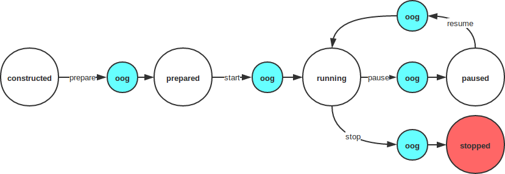

# Action

我们将系统服务Persona\(以下简称Persona\)的指令抽象为Action。一个Action可以理解为智能设备的一个行为，比如说话、做表情、调节设备音量、跳个舞等等。

### Action类型

| 类型 | 数据类型 | 值 | 描述 |
| --- | --- | --- | --- |
| **ACTION\_TYPE\_NORMAL** | int | 0 | 普通Action，可以被打断 |
| **ACTION\_TYPE\_CAN\_PAUSE** | int | 1 | 可以暂停的Action，并且暂停后会被压入PersonaClient Action栈中 |
| **ACTION\_TYPE\_MUST\_COMPLETE** | int | 2 | 不能被打断，一定要执行结束的Action |

### Action状态机、状态操作和状态切换

* 状态机



| 状态 | 数据类型 | 值 | 描述 |
| --- | --- | --- | --- |
| **STATE\_OPERATION\_ON\_GOING** | int | **operation\_on\_going** | **oog**，正在切换Action的状态 |
| **STATE\_CONSTRUCTED** | int | **constructed** | Action构造完成，即实例化 |
| **STATE\_PREPARED** | int | **prepared** | Action已经准备好执行 |
| **STATE\_RUNNING** | int | **running** | Action正在执行 |
| **STATE\_PAUSED** | int | **paused** | Action处于暂停状态 |
| **STATE\_STOPPED** | int | **stopped** | Action执行结束 |

* 状态操作

| 状态操作 | 数据类型 | 值 | 描述 |
| --- | --- | --- | --- |
| **OPERATION\_PREPARE** | String | **prepare** | 通知Action进行准备操作，并切换状态到**prepared** |
| **OPERATION\_START** | String | **start** | 通知Action开始执行，并切换状态到**running** |
| **OPERATION\_STOP** | String | **stop** | 通知Action，执行结束，并切换状态到**stopped** |
| **OPERATION\_PAUSE** | String | **pause** | 通知Action，暂停执行，并切换状态到**paused** |
| **OPERATION\_RESUME** | String | **resume** | 通知Action，回复执行，并切换状态到**running** |
| **OPERATION\_STOP\_NO\_WAIT** | String | **stop\_immediately** | 通知Action立即结束，并切换状态到**stopped** |

* 状态切换
  Action是一个抽象类，任何自定义的Action需要实现perform\(\)方法。

```java
// 当前状态
protected int mState = STATE_CONSTRUCTED;

/**
 * 状态切换通知
 */
protected void notifyListener()；

/**
 * @param op 状态操作
 * @param args 未使用，保留参数
 */
void perform(String op, Bundle args);
```

perform\(\)方法需要完成以下操作：

* 完成状态切换
    更新参数mState
* 发出状态切换通知
    调用notifyListener\(\)

### ActionSet

首先ActionSet继承自Action，它拥有Action所有的特征。ActionSet实际上定义为Action的容器，容器的结构是任意的。
我们目前提供以下常用的ActionSet：

* 串行Action容器：**SequentialActionSet**，即顺序执行容器内的Action
* 并行Action容器：**ConcurrentActionSet**，即并行执行容器内的Action
* 随机Action容器：**RandomActionSet**，即随机选择容器内的一个Action执行

一般地，ActionSet只在Action规则中使用

### 自定义Action

这里提供一个自定义Action的完整例子:
注：该例子旨在说明原理及一般处理原则，没有深究其实现。

```java
package com.roobo.sample;

import android.content.Context;
import android.graphics.Color;
import android.os.Bundle;
import android.os.Handler;
import android.os.Looper;
import android.view.View;
import android.widget.FrameLayout;

import com.roobo.persona.action.Action;

/**
 * Created by march on 17-2-4.
 */

public class UiAction extends Action {
    private Context mContext;

    /**
     * 父布局
     */
    private FrameLayout mParent;
    /**
     * 当前Action的布局
     */
    private View mView;

    /**
     * 由于有Ui相关的操作，所以创建主线程Handler
     */
    private Handler mHandler = new Handler(Looper.getMainLooper());

    public UiAction(Context c, Handler stateHandler, FrameLayout parent) {
        super(stateHandler);
        mContext = c;
        mParent = parent;
    }

    @Override
    public void perform(final String op, final Bundle args) {
        //由于设计Ui操作，所以做异步处理
        mHandler.post(new Runnable() {
            @Override
            public void run() {
                performInner(op, args);
            }
        });
    }

    private void performInner(final String op, final Bundle args) {
        switch (op) {
            case OPERATION_PREPARE:
                handlePrepare(args);
                break;
            case OPERATION_START:
                handleStart(args);
                break;
            case OPERATION_PAUSE:
                handlePause(args);
                break;
            case OPERATION_STOP:
                handleStop(args);
                break;
            case OPERATION_RESUME:
                handleResume(args);
                break;
            case OPERATION_STOP_NO_WAIT:
                handleStopNoWait(args);
                break;
        }
    }

    /**
     * 执行prepare操作
     * @param args
     */
    private void handlePrepare(Bundle args) {
        if (mState == STATE_PREPARED) {
            onPrepared();
        } else {
            mState = STATE_OPERATION_ON_GOING;
            doPrepare(args);
        }
    }

    /**
     *执行start操作
     * @param args
     */
    private void handleStart(Bundle args) {
        if (mState == STATE_RUNNING) {
            onStarted();
        } else {
            mState = STATE_OPERATION_ON_GOING;
            doStart(args);
        }
    }

    /**
     * 执行pause操作
     * @param args
     */
    private void handlePause(Bundle args) {
        if (mState == STATE_PAUSED) {
            onPaused();
        } else {
            mState = STATE_OPERATION_ON_GOING;
            doPause(args);
        }
    }

    /**
     * 执行stop操作
     * @param args
     */
    private void handleStop(Bundle args) {
        if (mState == STATE_STOPPED) {
            onStopped();
        } else {
            mState = STATE_OPERATION_ON_GOING;
            doStop(args);
        }
    }

    /**
     * 执行resume操作
     * @param args
     */
    private void handleResume(Bundle args) {
        if (mState == STATE_RUNNING) {
            onResumed();
        } else {
            mState = STATE_OPERATION_ON_GOING;
            doResume(args);
        }
    }

    /**
     * 执行stop_no_wait操作
     * @param args
     */
    private void handleStopNoWait(Bundle args) {
        if (mState == STATE_STOPPED) {
            onStoppedNoWait();
        } else {
            mState = STATE_OPERATION_ON_GOING;
            doStopNoWait(args);
        }
    }

    /**
     * 准备Action，比如加载布局、初始化等等
     * @param args
     */
    private void doPrepare(Bundle args) {
        //TODO 加载布局、初始化等等
        mView = new View(mContext);
        mView.setBackgroundColor(Color.RED);

        //准备工作结束
        onPrepared();
    }

    /**
     * 开始执行
     * @param args
     */
    private void doStart(Bundle args) {
        //TODO 将布局加到父布局中
        mParent.addView(mView);

        //已经开始
        onStarted();

        //TODO 这里简单延时结束
        mHandler.postDelayed(new Runnable() {
            @Override
            public void run() {
                handleStop(null);
            }
        }, 5000);
    }

    /**
     * 暂停操作
     * @param args
     */
    private void doPause(Bundle args) {
        //TODO 移除布局
        mParent.removeView(mView);

        //通知暂停操作完成
        onPaused();
    }

    /**
     *恢复到运行状态
     * @param args
     */
    private void doResume(Bundle args) {
        //TODO 添加布局
        mParent.addView(mView);

        //通知Action已经恢复
        onResumed();
    }

    /**
     * 结束Action
     * @param args
     */
    private void doStop(Bundle args) {
        //TODO 移除布局
        mParent.removeView(mView);

        //通知已经结束
        onStopped();
    }

    /**
     * 结束Action
     * @param args
     */
    private void doStopNoWait(Bundle args) {
        //TODO 移除布局
        mParent.removeView(mView);

        //通知已经结束
        onStoppedNoWait();
    }

    private void onPrepared() {
        mState = STATE_PREPARED;
        //通知状态改变
        notifyListener();
    }

    private void onStarted() {
        mState = STATE_RUNNING;
        //通知状态改变
        notifyListener();
    }

    private void onPaused() {
        mState = STATE_PAUSED;
        //通知状态改变
        notifyListener();
    }

    private void onStopped() {
        mState = STATE_PREPARED;
        //通知状态改变
        notifyListener();
    }

    private void onResumed() {
        mState = STATE_RUNNING;
        //通知状态改变
        notifyListener();
    }

    private void onStoppedNoWait() {
        mState = STATE_STOPPED;
        //通知状态改变
        notifyListener();
    }
}

```

