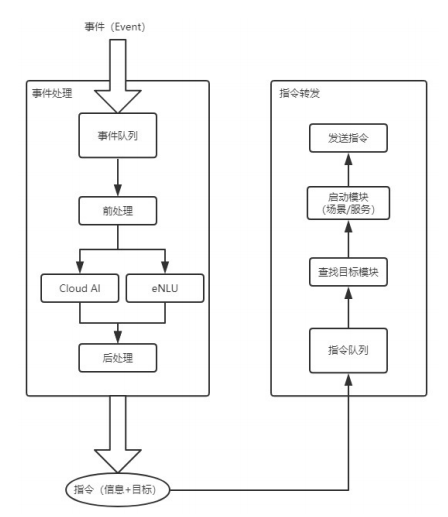

## 用户交互过程
用户交互从语音输入开始，经过语音识别转换成文字，封装成事件(Event)经过前处理器进行过滤，随后同时进入本地语义理解(eNLU)和云端语义理解(Cloud AI)并得到最终结果。语义处理的结果返回经过后处理器进行再次加工，变成一系列AI命令，被发送到对应的场景或者服务模块。

* 有关前处理器和后处理器相关内容，请参考:[事件处理器](processor.md)
和[规则系统](processor_rules.md)
* 有关Cloud AI，请参考：[Cloud AI](cloud_ai.md)
* 有关eNLU，请参考：[eNLU](enlu.md)
* 有关场景配置，请参考：[场景服务](scene.md)
