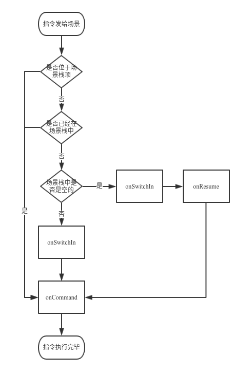
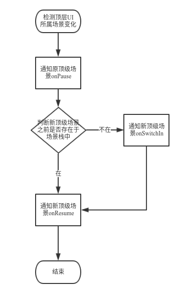

## Concepts

Scene（场景），在产品层面上是体现一个机器人交互能力的直接途径，是体现用户体验质量的直接载体，是用户的直接交互对象；同时在技术层面上是AI消息传递机制中的module（基本模块），是AICommand发送的目标\(target\)，场景作为与用户直接交互的对象，拥有自己的生命周期，开发者用户需要严格按照生命周期来开发自己的程序。

#### 场景名

场景名即 module name（模块名），当系统收到的指令总会有一个 target（发送目标），它往往指的就是 module name（模块名）。

#### 场景栈
管理多个场景之间的顺序，用于处理系统指令的分发和焦点控制

#### 如何将场景接入系统？
##### 声明 - AndroidManifest.xml

一个场景在开发前需要在 AndroidManifest.xml 中声明两个 meta-data 段，如下例子中，场景 Translator 声明：

```xml
<meta-data
    android:name="ROOBO_MODULE_NAME"
    android:value="Translator" />
<meta-data
    android:name="ROOBO_MODULE_TYPE"
    android:value="scene"/>
```

其中 ROOBO\_MODULE\_NAME 代表该模块的名字，必须声明，同一系统上的模块名不能重复，ROOBO\_MODULE\_TYPE 代表该模块的类型，值有三种，scene、service和其他，默认不写该项指的是其他。作为一个场景，值为 scene。 一个场景开发时可以选择依赖 SceneSDK.jar（[下载页面](#)），还需要在 AndroidManifest.xml 中声明DefaultService：

```xml
<service
    android:name="com.roobo.core.communication.DefaultService"
    android:exported="true"/>
```
该服务用于系统唤醒场景所属的进程，已在SceneSDK中包含。

##### 场景初始化
场景的初始化不同于模块初始化，它依赖 com.roobo.core.scene.SceneHelper，需要在 Application.onCreate 时尽量早的地方调用：

```java
SceneHelper.initialize(this);
```

该函数会把该场景 attach 到系统中，以 “告知” 系统场景进程已经启动，并参与到模块通讯机制中。

#### 场景回调函数注册

为了能够接收指令消息（AICommand），需要（建议也在 Application.onCreate\(\) 中）注册场景回调函数（包括生命周期函数）：
```java
SceneHelper.setEventListener(new SceneEventListener() {
  @Override
  public void onSwitchOut() {
    // 场景退出
  }
  @Override
  public void onSwitchIn(int flags) {
    // 场景进入
  }
  @Override
  public void onCommand(String action,
      Bundle params,
      List<String> suggestion) {
        // 重要：指令回调！！！
    }
  @Override
  public void onPause() {
  // 场景退到后台
  }
  @Override
  public void onResume() {
  // 场景来到前台
  }
  @Override
  public void onSaveSceneData(Bundle data) {
  // 场景退到后台之际，保存数据
  }
  @Override
  public void onRestoreSceneData(Bundle data) {
  // 场景重新回到前台时，恢复数据
  }
});
```

#### 顶级场景
如果一个场景位于场景栈中的最上层，那么他就是顶级场景。

#### 生命周期函数

一个 Scene（场景）的生命周期函数有如下几个：
* onSwitchIn： 场景被切入。场景的切入指的是场景被放入场景栈。
* onRestoreSceneData：恢复场景数据。这个回调只有在onSaveSceneData中场景确实存入了数据之后才会被调用。
* onResume：场景被恢复。
* onPause：场景被暂停。
* onSaveSceneData：保存场景数据。
* onSwitchOut：场景被切出。

当指令将要发送给场景时，相关生命周期函数被调用的时机如下图：


系统检测当前最上层UI所属的场景变化时，相关的流程如下图：


其中onSaveSceneData总在onPause之前会被调用。

如果场景在onSaveSceneData方法中存入过数据，那么在onResume之前被调用onRestoreSceneData

当场景调用SceneHepler调用switchOut时，onSwitchOut回调并不会立刻执行，而是打上标记，等到下一次场景栈中发生变化时才会调用
