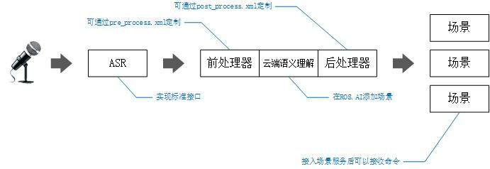

## 用户交互过程
用户交互从语音输入开始，经过语音识别转换成文字，经过前处理器进行过滤，随后进入云端进行语义理解。语义处理的结果返回经过后处理器进行再次加工，变成一系列AI命令，被发送到对应的场景或者模块。

* 有关前处理器和后处理器相关内容，请参考:[事件处理器](processor.md)
和[规则系统](processor_rules.md)
* 有关云端场景配置，请参考：
* 有关场景配置，请参考：场景服务
