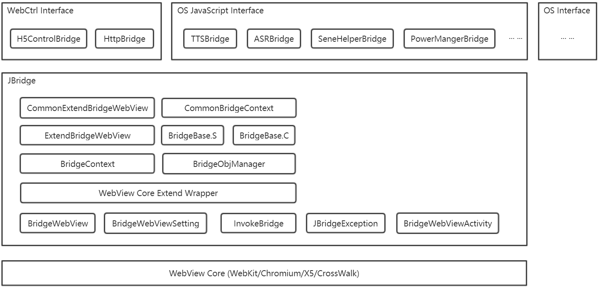

# OS JavaScript Runtime
在场景开发过程中, 经常会使用WebView/H5技术来实现热更新部署, H5虽然已经能够实现富文本信息展现的功能, 但是一旦涉及到本地功能, 如与宿主(apk)通信访问宿主本地(Java)代码, 或是使用离线ASR(语音识别), 又或者想使用硬件资源, 注册某些传感器的监听, 那么就不得不面临与宿主通信的问题.

Android原生WebView已经提供了两种机制分别应对WebView->Java和Java->WebView的通信需求: 对于WebView->Java的需求, WebView的接口addJavascriptInterface能够将一个Java对象注册到WebView的JavaScript环境中, 并指定了对应的JavaScript对象的名字, 以供JavaScript端调用; 而对于Java->WebView的需求, 可以通过加载javascript:xxx(xxx)来执行JavaScript中的方法. 

OS JavaScript Runtime基于上述两种机制扩展开来, 提供了一套中间件和OS的JavaScript接口, 它能够:
1. 解决了addJavascriptInterface的安全问题
2. 能够让使用者方便的面向对象式调用
3. 拥有了异常机制
4. 方便的传递回调
5. 同步调用(但需要注意调用线程)
6. 直接从JavaScript环境调用OS的接口
7. 增加操控WebView所在容器的方法

## 功能架构



### OS Interface
OS-JS-RT是**依赖于RooboOS运行的**, 详细的OS接口说明请看其他的services模块.

### OS JavaScript Interface
提供了SceneSDK中的所有接口的JavaScript版本, 其中包括:
1.  TtsService
2.  SceneHelper
3.  NluHelper
4.  RooboPowerManager
5.  FocusManager
6.  Authorizor
7.  AsrManager
8.  LocationProxy
9.  Playback
10. Configure
11. SceneManager

我们将以VuiPlatform.js的形式提供这些接口. 

### WebCtrl Interface
提供了操控WebView容器的几个重要接口, 其中包括:
1. WebCtrl
   1. init - 初始化
   2. finish - 销毁容器
   3. putSession - 存储KV值, 当前页面有效
   4. getSession - 存储KV值, 当前页面有效
2. BridgeHttp - 跨域访问

### JBridge
JBridge是一个JavaScript-Java的通信中间件, 它为OS JavaScript Interface提供了通信基础, 应用程序可以直接使用它提供的BridgeWebViewActivity和CommonExtendBridgeWebView作为H5的WebView容器, 通过它, 不仅可以直接使用内置其中的WebCtrl/BridgeHttp接口, 或者通过VuiPlatform.js使用OS接口, 而且也可以自行实现新的JBridge接口.

### WebView Core
JBridge可以运行在各类WebView内核之上, 它提供了两个接口抽象:BridgeWebView和BridgeWebViewSetting, 基于此可以将原生或者第三方的WebView扩展为用于JBridge的组件. 目前JBridge使用的是CrossWalk内核.

## 接入流程
本节以使用TtsService接口为例, 详细说明下OS-JS-Runtime的接入过程.

### 步骤一: 推荐使用BridgeWebViewActivity
使用BridgeWebViewActivity代替默认的Activity基类, 当其启动时, WebView内核将进行初始化, 并在初始化完成时调用onWebViewReady回调方法.
```java
public abstract class BridgeWebViewActivity extends Activity {
    protected abstract void onWebViewReady();
    protected void onWebViewFaield() {
        this.finish():
    }
}
```
建议继承BridgeWebViewActivity并在onWebViewReady中再对WebView控件进行操作.

### 步骤二: 使用CommonExtendBridgeWebView
布局中使用CommonExtendBridgeWebView:
```xml
<com.roobo.jbridge.common.CommonExtendBridgeWebView 
    android:id="@+id/webiew"
    android:layout_width="match_parent"
    android:layout_height="match_parent" />
```

Java代码中初始化CommonExtendBridgeWebView:
```java
public class TestActivity extends BridgeWebViewActivity {
    @Override
    protected void onWebViewReady() {
        CommonExtendBridgeWebView webview = (CommonExtendBridgeWebView) findViewById(R.id.webiew);
        webview.init();
    }
}
```
你应该在onWebViewReady回调中调用init方法.

### 步骤三: H5页面初始化
JBridge的环境在整个页面**加载完毕后**会自动开始, 你可以像如下代码一样编写对WebViewReady事件的监听, 并在页面加载时使用, 在callback做正式的页面逻辑:
```JavaScript
function init(callback) {
    if (window.JBridge && window.JBridge.WebViewReady) {
            console.log("WebView ready");
            callback();
    } else {
        console.log("WebView not ready, wait event WebViewReady");
        document.addEventListener(
                'WebViewReady'
                , function () {
                    console.log("WebView ready");
                    callback();
                },
                false
        );
    }
}
```

### 步骤四: 使用VuiPlatform的TtsService接口
这里我们使用上一步写的init方法来实现在页面加载完毕后播放一句TTS(内容是"Hello JBridge"):
```JavaScript
<!DOCTYPE html>
<html>
<script type="text/javascript" src="VuiPlatform.js"></script>
<body>Hello JBridge</body>
<script>
    function init(callback) {
        if (window.JBridge && window.JBridge.WebViewReady) {
                console.log("WebView ready");
                callback();
        } else {
            console.log("WebView not ready, wait event WebViewReady");
            document.addEventListener(
                    'WebViewReady'
                    , function () {
                        console.log("WebView ready");
                        callback();
                    },
                    false);
        }
    }
    (function () {
        init(function () {
            TtsService.playTts("Hello JBridge");
        });
    })();
</script>
</html>
```
页面中需要引入VuiPlatform.js.
