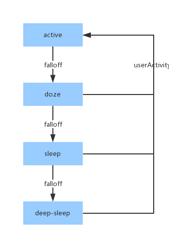

## Concepts
PowerManager（电源管理）是智能设备必要的组件之一，机器人系统通过电源管理来实现机器人的休眠、打盹、唤醒状态的切换。  
电源管理的设计目标是提供一种能够根据应用状态切换硬件供电策略的方法。对于Android标准的电源状态而言，语音交互设备所表现出来的交互状态更加丰富。  
在很多时候，我们希望语音交互设备处在一种低能耗状态，但是保持某些基础软件能力处于活动状态，此时减少电源消耗，延长待机时间变成了用户的强烈需求。  
电源管理器提供全局的状态同步机制，各个模块根据当前的电源状态设定硬件的宫殿策略，从而达到省电的目的。
#### 状态机
在 RooboOS 中可以定义多个电源状态（至少 1 个 active，状态序列可配），比如 active、doze、sleep、deep-sleep，active 即唤醒状态，当在此状态时 ASR 模块处于激活状态，当 30s（预设）内没有用户其他活动时，电源将降至 doze 状态，这种行为我们称为 falloff，同理依次 falloff 至 deep-sleep。在每一个非 active 的状态上，每有用户活动都会导致状态切回最高级别 active，这种行为我们称为 userActivity。如下图所示为状态机的变化规律：

##### 唤醒
唤醒状态是机器人的常态，当用户正常与机器人交互时的状态就是唤醒状态，只有处在唤醒状态时 ASR 模块才会正常工作，识别用户指令并访问 CloudAI。
##### 休眠
休眠状态下，ASR 模块只接收离线的唤醒指令。
#### wakelock
Android 原生的 WakeLock 是能够保持 CPU 不休眠、屏幕常亮，RooboOS 中的 WakeLock 包含了 Android WakeLock 的功能，并加入了保持电源状态的功能，它能够保持电源在某一个状态不变。
## Tutorial
#### 监听变化回调
有两种方法能够让我们的程序监听电源状态的变化从而做出相应的动作，一种是靠 RooboOS 的消息机制，电源状态在变化时会发出一个 state（sticky 属性的 AIEvent），key 为 power.state，value 为对应的状态名（比如 active），当电源状态变化时系统将会发出两个 trigger（非 sticky 的 AIEvent），key 分别是 power.state.change.from 与 power.state.change.to，我们可以在规则文件（pre_process.xml 与 post_process.xml）中通过编写规则来给指定模块发指定消息，如下规则：
```xml
<rule id="power_state_change">
	<condition>
		<item var1="$input:power.state.change.to" opcode="equal" var2="sleep" />
	</condition>
    <output value="$self:sleep:output" />
</rule>
```
另一种方式是通过类 RooboPowerManager 提供注册（反注册）电源状态监听的接口：
```java
// IPowerStateChangedListener.aidl 文件
interface IPowerStateChangedListener {
    void onStateChanged(String oldState, String newState);
}
class RooboPowerManager {
	public void addStateChangedListener(IPowerStateChangedListener listener);
	public void removeStateChangedListener(IPowerStateChangedListener listener);
}
```
这种方式的特点就是能够及时监听到电源变化。
#### 使用 wakelock 保持状态
类 RooboPowerManager 提供 wakelock 相关的接口，与 android 原生接口基本类似：
```java
class RooboPowerManager {

	public RooboWakeLock newWakeLock(String stateLocked);
	
	public final class RooboWakeLock {
		public void acquire();
		public void release();
		public void setReferenceCounted(boolean value);
		public boolean isHeld();
	}
}
```
其中 stateLocked 指的是该 wakelock 能够将电源状态 “锁” 在哪一级之上，若当前级别在 stateLocked 之下，则系统将把电源状态提至 stateLocked，若有多个 wakelock 同时 “锁”，则按最高级别的为准。
#### 使用 userActivity 让电源状态保持 active
类 RooboPowerManager 提供 userActivity 的接口，可以让输入设备实现方在用户有有效输入时调用，该方法可以让电源状态保持 active 状态，并将 falloff 计时器重置。
```java
class RooboPowerManager {
	public void userActivity(String reason);
}
```
其中 reason 可以写代表用户活动的描述，用于 log 输出。