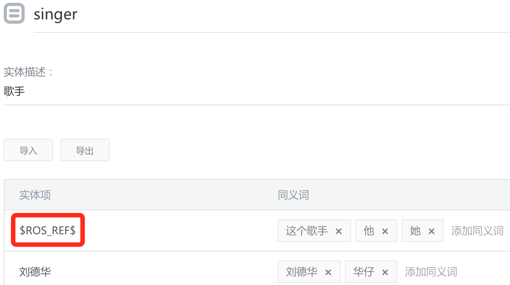

#实战：指代
指代作为一种常见的语言现象，广泛存在于自然语言的各种表达中。指代消解一般分为**显性代词消解**，**零代词消解**与**共指消解**三类。前两种在实际中应用最为常见。

## 1 显性代词消解
##### 操作步骤
1. 给你的实体加一个特殊的实体项`$ROS_REF$`
2. 给你的实体标记一个类型`[时间 or 地址 or 人物]` 

##### 指代方法

若命中实体中特殊的`$ROS_REF$`

 - 与上一轮属于同一个场景，则用上一轮中同名的实体做替换
 - 与上一轮不属于同一个场景，则用上一轮中同类型的实体做替换
 - 若上一轮没有对应的实体，则不做替换

## 2 零代词消解
所谓零代词消解，是代词消解中针对零指代（Zero Anaphora）现象的一类特殊的消解。在篇章中，用户能够根据上下文关系推断出的部分经常会省略。比如：`北京今天天气？` `明天呢。`后一句中省略了代词，指向的是前一句中的地名`北京`。
零代词没有显示的指代词，要不要继承前一句中的实体就是一个问题，全部继承肯定不合适。所以我们将这个问题推迟到场景内去解决，具体的场景内最清楚前一句中的哪些实体应该继承保留。

